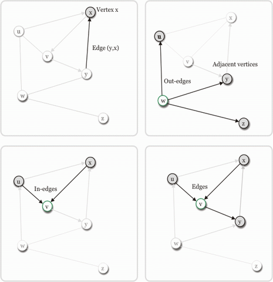

#### Graph Theory Reminder

This is intended to refresh these notions for those who have not played with them recently. It is also intended to specify the standards names used in the project and the library itself. As much as possible, QuickGraph naming convention follows the standard of graph theory naming.
 

##### Directed Graph, Vertex, Edges

Let us start by redefining the basic concepts of directed graphs, vertices and edges. All these definitions are illustrated in the figure above.

* A **directed graph** {{G=(VxE)}} consists of a finite set {{V=V(G)}} of vertices and a finite multi-set {{E}} contained in {{VxV = {(u,v)| u,v in V}}} of edges that are ordered pair of vertices where {{u}} is called the **source vertex** and {{v}} the **target vertex**.

_Tip:_
* **TVertex** and **TEdge** are generic parameters in QuickGraph. The {{TEdge}} parameter has an additional constraint that it has to implement {{IEdge<TVertex>}}
{{
public interface IEdge<TVertex>
{
    TVertex Source {get;}
    TVertex Target { get;}
}
}}
{{
public interface ISomeGraphAlgorithm<TVertex,TEdge>
    where Edge : IEdge<TVertex>
{…}
}}

* If {{e=(u,v)}}, then {{e}} is an **out-edge** of {{u}} and an **in-edge** of {{v}}. **{{in-degree(v)}}** denotes the number of incoming edges of {{v}} and **{{out-degree(u)}}**, the number of outgoing edges of {{u}}. The degree of {{u}} is the sum of its in-degree and out-degree.
* If a graph allows multiple edges from the same {{u}},{{v}} vertex pair, it is called a **multi-graph**. Such edges are called **parallel edges**.
* A **path** from {{u}} to {{v}} is a sequence of edges {{e1,e2,...,en}} such that {{e1}} source is {{u}}, {{en}} target is {{v}} and each edge in the sequence is an out-edge of it’s predecessor. 
* A **cycle** is a path where the beginning vertex is equal to the end vertex. 
* A **directed acyclic graph** (DAG) is a directed graph with no cycle.
* A **weighted directed graph** {{G:(VxExW)}} is a directed graph with an additional relation that associate each edge to a weight: {{e -> w(e)}} (for example, the distance).
* An [adjacency graph](AdjacencyGraph.md) is a data structure to represent a directed graph where the out-edges of any vertex can be accessed in amortized constant time. 
* A [bidirectional graph](BidirectionalGraph.md) is a data structure to represent directed graph where both the out-edges and the in-edges of any vertex can be accessed in amortized constant time. 
* QuickGraph also provides data structures for [UndirectedGraph](UndirectedGraph.md).

_tip:_
The adjacency graph is implemented as a dictionary of Vertex to a collection of out-edges. When using a bidirectional graph, two dictionaries (one for in-edges, one for out-edges) have to be used, which doubles the required memory. Such data structures are most efficient for sparse graphs.
